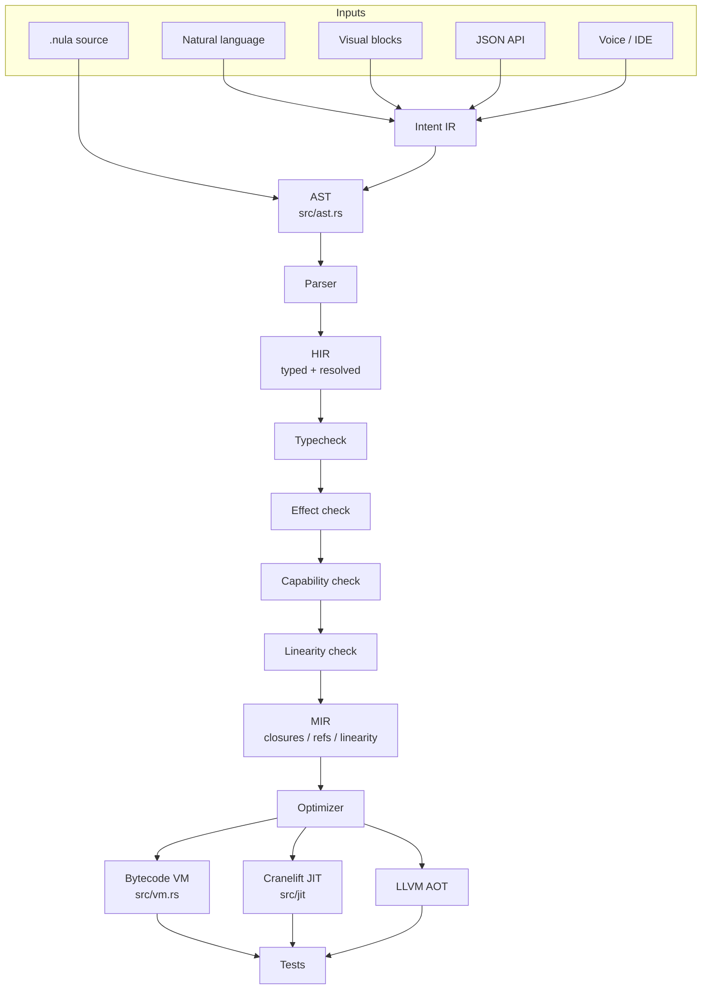
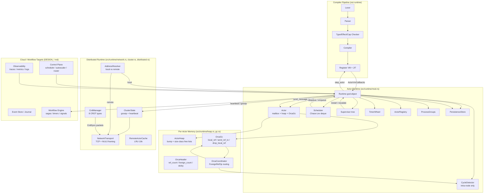
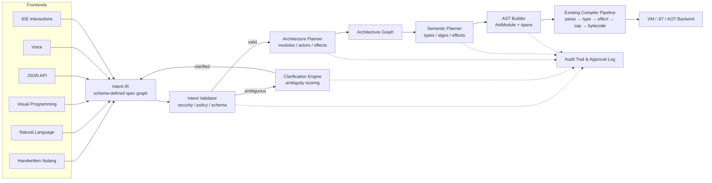
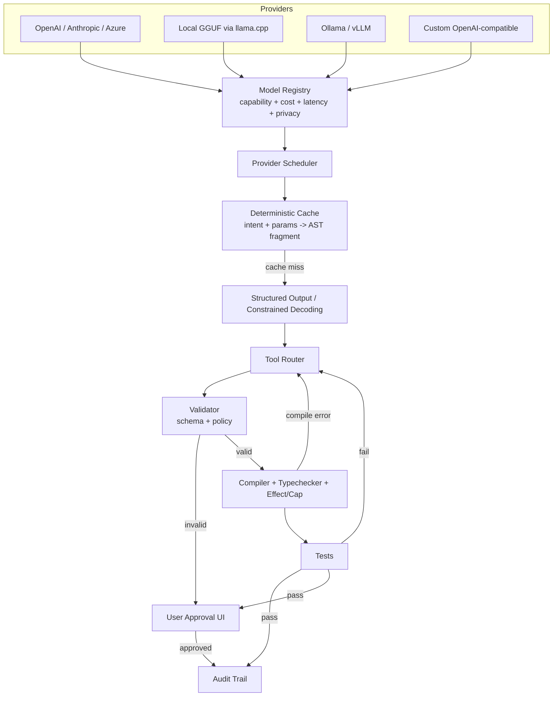
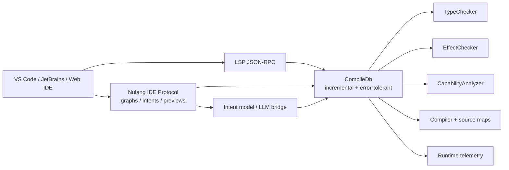
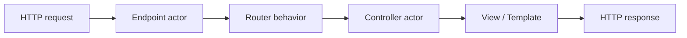
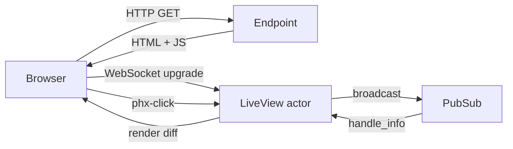
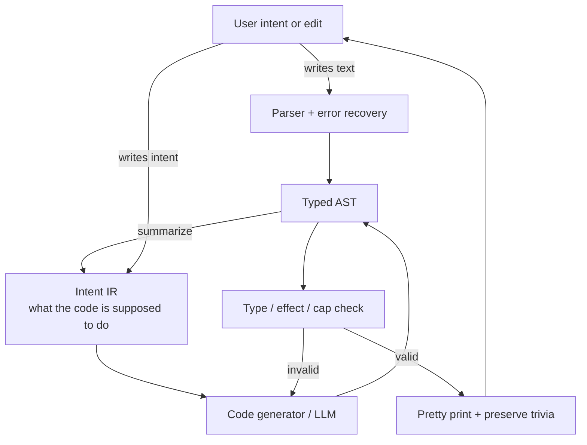
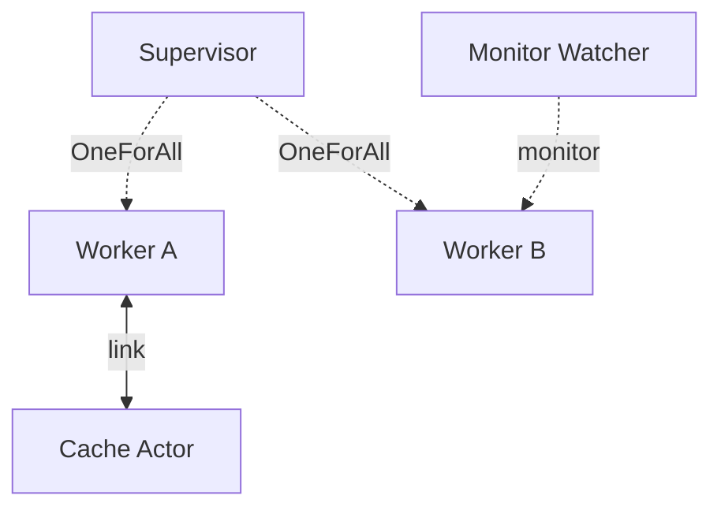

# Nulang 50-Year Architecture Review — Diagrams

> **Status:** Central diagram reference for the architecture review.  
> **Date:** 2026-07-06

---

## 1. Compiler Architecture

This diagram shows the proposed pipeline from multiple frontends through Intent IR, AST, HIR, MIR, optimizer, and backends.

---

## 2. Runtime Architecture

This diagram shows the actor runtime, memory management, distributed runtime, and cloud/workflow targets.

---

## 3. Natural-Language Compilation Pipeline

This diagram shows how multiple frontends converge on Intent IR, which is validated, clarified, planned, and lowered to AST before entering the deterministic compiler pipeline.

---

## 4. AI Architecture

This diagram shows where AI participates in the Nulang toolchain, how providers are abstracted, and the validation/audit loop that keeps compilation deterministic.

---

## 5. Semantic IDE Server Architecture

This diagram shows how the IDE server sits on top of the compiler database and runtime telemetry to power LSP and richer Nulang-native tools.

---

## 6. Web Framework / LiveView Request Lifecycle

This diagram shows how HTTP requests and WebSocket connections map to supervised actors.

---

## 7. Text ↔ Intent ↔ AST Loop

This diagram shows bidirectional editing in the IDE: text, intent, and AST stay in sync, with type/effect/capability checks as the safety gate.

---

## 8. Supervision / Actor Graph Example

This diagram shows a typical supervision tree with links and monitors.

